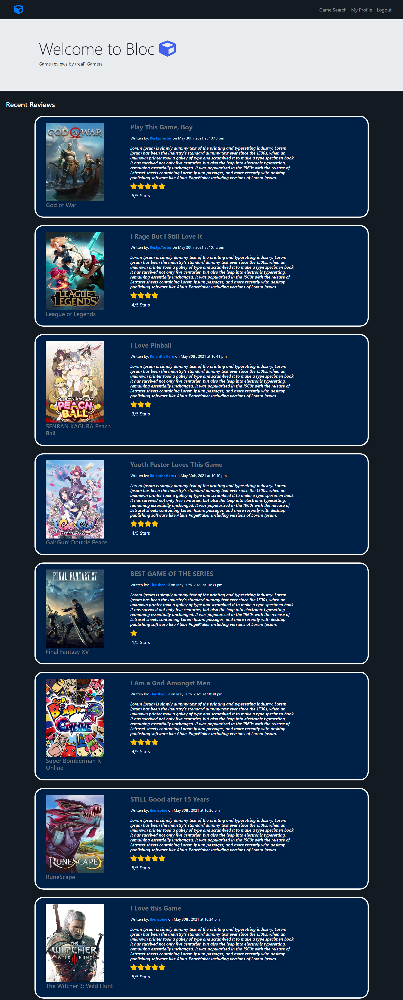

# Bloc 2.0

## Table of Contents 
  * [Description](#description)
  * [Technologies & API](#technologies-&-api)
  * [Screenshot](#screenshot)
  * [Credits](#credits)
  * [Heroku](#heroku)

## Description
Hello! Welcome to the Bloc. The Bloc is a social media site gamers can flock to and find unbiased and honest game reviews. By searching for a game title, users can view an archive of game reviews written by other Bloc users. They can also choose to write their own thoughts and experiences into their own reviews to be discovered by other Bloc users on their visit. The Bloc also allows for people to follow each other in order to show support towards one another. 

## Technologies & API
The Bloc uses Node, React, Apollo, GraphQL, Mongo, JavaScript, and jQuery just to name a few. It also uses the IGDB API in order to access their enourmous game library. 

## Screenshot

## Credits
- James Canlas
<http://github.com/jcc83267> <jamescanlasjr@yahoo.com>

- Joseph Prospero
<https://github.com/josephprospero> <jprospero413@gmail.com>

- Joshua Rendon
<http://github.com/jmrendon48> <jmrendon48@gmail.com>

- Kevin Tulakyan
<http://github.com/KevinTulakyan> <kevintulakyan@gmail.com>

## Heroku
https://the-bloc.herokuapp.com/
